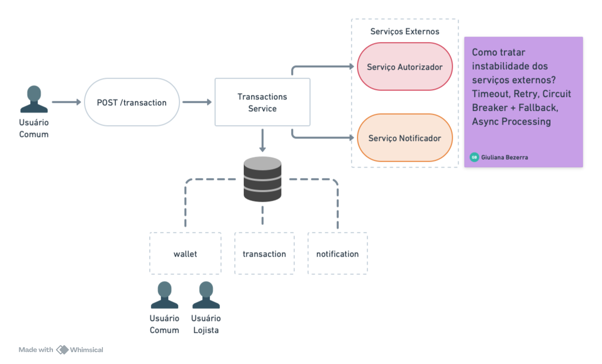
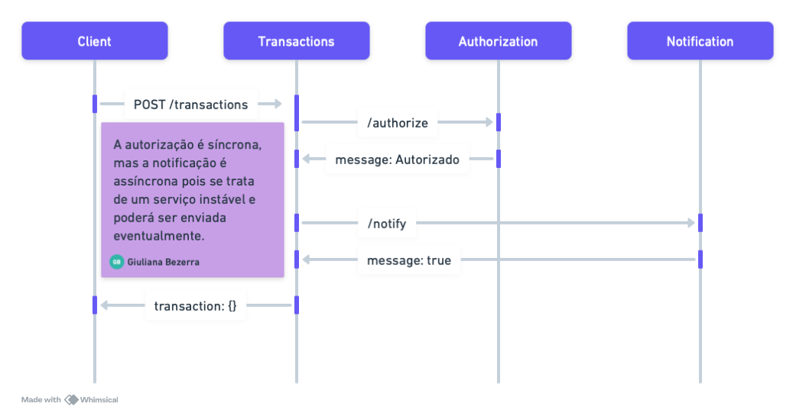

<h1 align="center">
  PicPay Backend Challenge
</h1>

<p align="center">
 
</p>

Project made to solve [this challenge](https://github.com/PicPay/picpay-desafio-backend?tab=readme-ov-file) following the guidelines from [Giuliana Bezerra](https://www.youtube.com/@giulianabezerra), presented in [this video](https://youtu.be/YcuscoiIN14).
I made some adapting in the code, but the core is essentially as it is in the video.

***ONLY FOR STUDYING PURPOSES***

## Technologies

- [Spring Boot](https://spring.io/projects/spring-boot)
- [Spring MVC](https://docs.spring.io/spring-framework/reference/web/webmvc.html)
- [Spring Data JPA](https://spring.io/projects/spring-data-jpa)
- [Spring for Apache Kafka](https://spring.io/projects/spring-kafka)
- [Docker Compose](https://docs.docker.com/compose/)
- [MySQL](https://dev.mysql.com/doc/)
- [Flyway](https://www.h2database.com/html/main.html)

## How to execute

- Clone git repository:
```
git clone https://github.com/cpsoneghett/picpay-backend-challenge.git
```
- Run Kafka:
```
docker-compose up
```
- Run Spring Boot Application
- Access Application in `http://localhost:8080`.

## Architecture

The architecture design as the activities diagram were created by [Giuliana Bezerra](https://www.youtube.com/@giulianabezerra).





## API

- http :8080/transaction value=100.0 payer=1 payee=200
```
HTTP/1.1 200
Connection: keep-alive
Content-Type: application/json
Date: Tue, 05 Mar 2024 19:07:52 GMT
Keep-Alive: timeout=60
Transfer-Encoding: chunked

{
    "createdAt": "2024-03-05T16:07:50.749774",
    "id": 20,
    "payee": 2,
    "payer": 1,
    "value": 100.0
}
```

- http :8080/transaction
```
HTTP/1.1 200
Connection: keep-alive
Content-Type: application/json
Date: Tue, 05 Mar 2024 19:08:13 GMT
Keep-Alive: timeout=60
Transfer-Encoding: chunked

[
    {
        "createdAt": "2024-03-05T16:07:50.749774",
        "id": 20,
        "payee": 2,
        "payer": 1,
        "value": 100.0
    }
]
```

## Version History

| Version | Release Date | Description           |
|:-:|:------------:|:----------------------|
|  1.0.0  |  2024-03-22  | Initial Release       |
